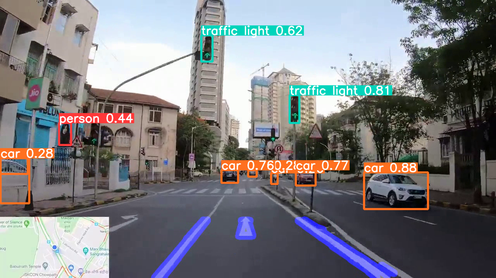
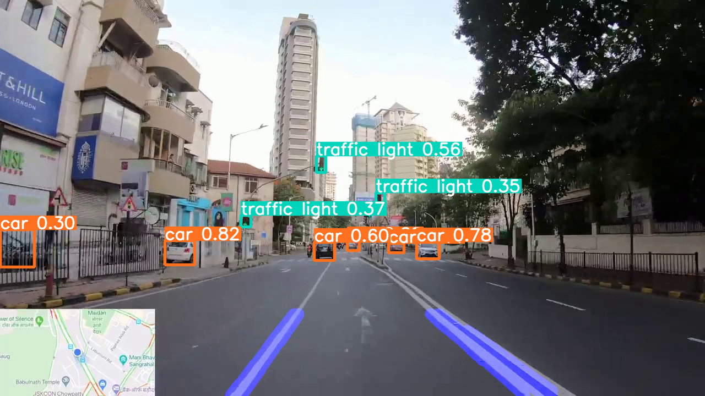
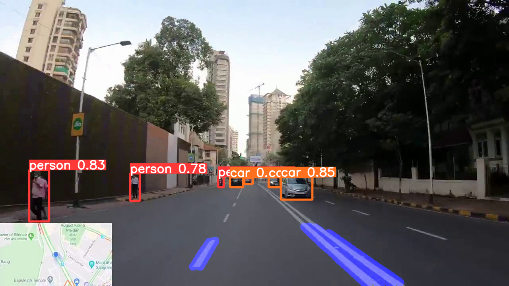
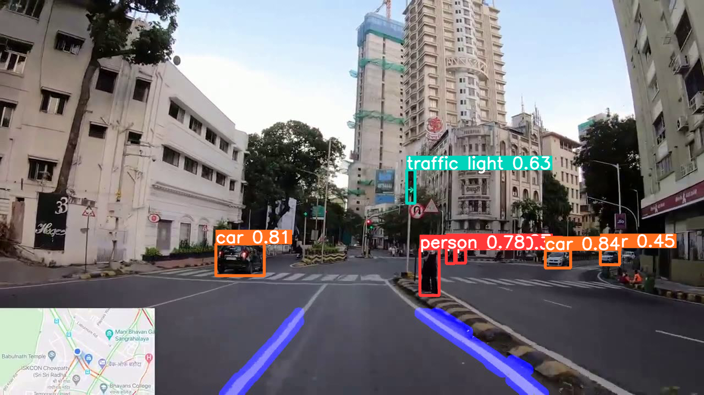
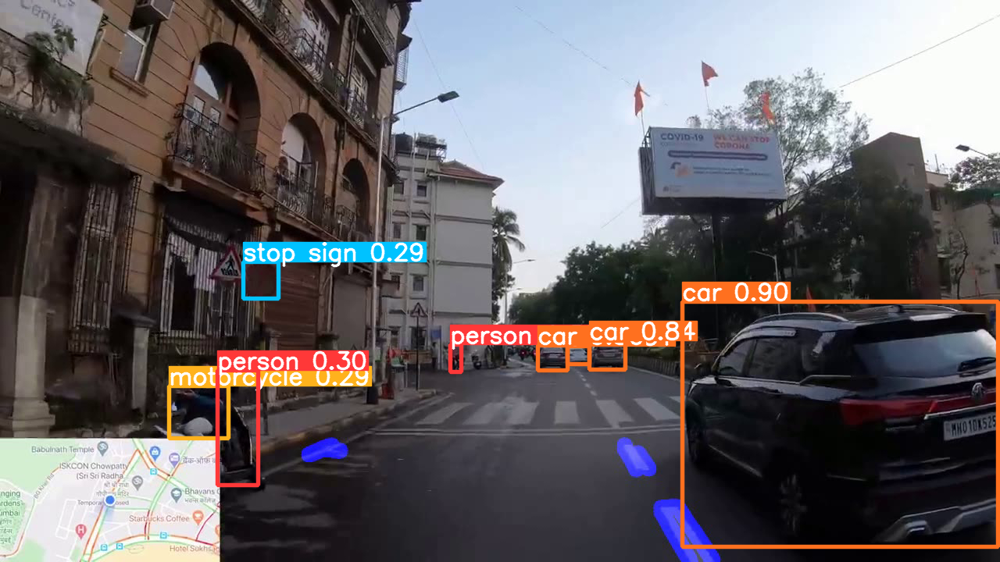
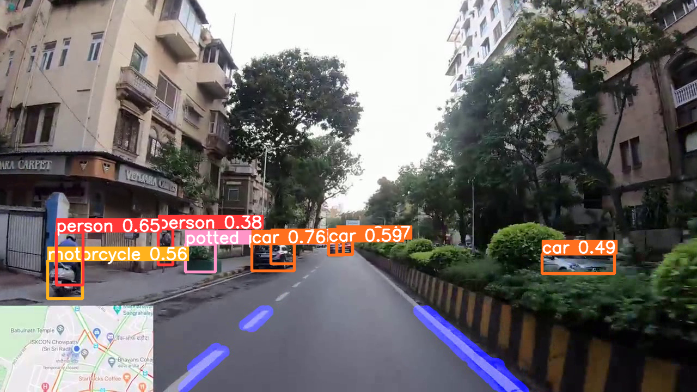

># Real-Time Lane Detection using OpenCV

# Requirements:

* Python version 3 or above (with pip, matplotlib, numpy)
* OpenCV Library for python package
* Recommended CUDA with CUDNN (For Nvidia GPU Processing)
* Yolo Version 5 Repository with yolov5s.pt model (required files are  included in this repository itself) 

# To Run (Tested on Ubuntu):

1. Clone this repository
2. Get a New Terminal from the current location
3. Type "python3 lane.py & python3 yolov5/detect.py --source ./lines.avi --view-img"
4. You can include any video as your wish by modifying the lane.py file. (here video.m4v is the selected video)

# Screenshots:

# Screen Record of Detection:

Link: https://www.youtube.com/watch?v=GI6RYhoI1Bo
(Tested on Ubuntu 21.04)

# Reference:

https://github.com/ultralytics/yolov5

